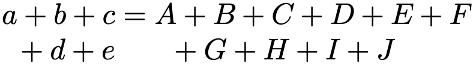
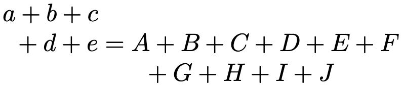
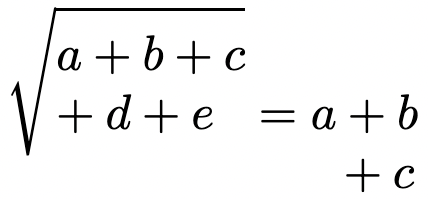

.. _v4-linebreaking:

=====================
Line-breaking Support
=====================

Version 4 includes the long-awaited implementation of automatic and
explicit line breaking of math expressions.  The support in v4 is an
improvement over that in v2 in a number of ways.  In particular,
version 4 includes the option of breaking in-line expressions so that
long expressions near the end of a line will automatically break and
wrap to the next line.  This is accomplished by allowing the browser
to break the expressions where it needs to (following TeX's rules for
what constitutes a valid in-line breakpoint).  For display equations,
version 4 provides support not only for automatic line breaking, but
also for several other options for handling wide equations, including
scaling the equation (to fit the container size), and scrolling if it
is too wide.  The page author can set the default, but there is also a
new menu item where the viewer can switch the overflow handling to
match their preferences.

Another improvement in v4 concerns line breaking within tables.
MathJax now attempts to break cells within tables based on the size of
table as a whole, whereas v2 broke cells only if they individually
were too wide for the container, and broke them to the container width
regardless of the size of the rest of the table.  Version 4 also
implements line-breaking of ``<mtext>`` elements (which are created by
``\text{}`` and other text-mode macros) , so long textual material can
be broken automatically; this was not available in version 2.

Finally, as part of the line-breaking support, a number of new TeX
macros have been made available to control line breaks (to make them
more or less desirable, or force or prevent them entirely).  Also,
support has been added for additional ``array`` environment template
patterns that can be used to control the width of and automatic line
breaking within table cells, as well as insert text before or after
every cell in a column, or adjust the spacing between columns.  New
macros for creating boxes of specific widths in which line breaking
will occur are also available, and there are options for controlling
justification and indentation of the text.  Such boxes are also
available in MathML via additional options for the ``<mpadded>``
element.

.. _v4-display-breaking:

Display breaking
================

The algorithm used in version 4 for breaking displayed equations is
based on the one from version 2, but is not identical to it.  Unlike
version 2, the results should be nearly identical between the CHTML
and SVG output renders, and the code is set up so that the algorithm
can be updated or even replaced much easier than in v2.  We do have
plans for improvements that we hope to make in the future.

The page author can control the method used to handle long expressions
via the new :data:`displayOverflow` output jax configuration option,
which can be set to ``overflow``, ``scale``, ``scroll``, ``truncate``,
``linebreak``, or ``elide``, though the latter is not yet implemented.
The reader can override the default using the MathJax contextual
menu, which has a new item in the `Math Settings` submenu for handling
`Wide Expressions`.  For MathML input, MathJax version 4 now honors
the ``overflow`` attribute of the ``math`` element, so you can mark a
single long expression for line breaking, or for scrolling, for
example.

When :data:`displayOverflow` is set to ``linebreak``, the breaking is
controlled by the settings in the :data:`linebreaks` sub-block of the
:data:`output` (or :data:`chtml` or :data:`svg`) block.  The default
settings are

.. code-block:: js

    linebreaks: {             // options for when overflow is linebreak
      inline: true,              // true for browser-based breaking of inline equations
      width: '100%',             // a fixed size or a percentage of the container width
      lineleading: .2,           // the default lineleading in em units
      LinebreakVisitor: null,    // The LinebreakVisitor to use
    }

The last option is used to replace the line-breaking algorithm with a
new one, so is a developer option, but the others are author-level
settings that control things like how wide the lines are allowed to
be, and how much extra space to put between lines.

.. _v4-inline-breaking:

In-line breaking
================

In version 4, in-line expressions can be allowed to break
automatically by the browser.  This is controlled via the
:data:`inline` option of the :data:`linebreaks` block described above.
When ``true`` (the default), MathJax will arrange for in-line
expressions to be broken into pieces so that the browser can move
parts of the equation onto the next line if they would otherwise
extend beyond the width of the expression's container.  (In version 2,
in-line expressions are only broken when the expression by itself
would be wider than the container, and in that case, the expression
would essentially act like it was inside a ``
`` element, so it
badly disrupts the flow of the paragraph, and could cause misleading
wrapping of text around the broken expression).

Note, however, that in order to do this, MathJax must make several
separate elements containing math, and for SVG output in particular,
several separate top-level ``<svg>`` elements.  For this reason, node
applications that are trying to create single SVG images for the
mathematics would want to set :data:`linebreaks.inline` to ``false``
to avoid that.

Finally, because the browser is doing the actual determination of the
locations for in-line breaks, these breaks are chosen purely by how
much of the expression can fit at the end of the line before the
break.  That is, the parameters that mark breakpoints as good or bad
(described below) are not taken into effect; however, forced breaks
and no-break markers are respected.

.. _v4-preamble:

New TeX Array Preamble Options
==============================

To help support line breaking within cells of wide tables, MathJax v4
includes support for the preamble column declarations defined in the
`array <https://ctan.org/pkg/array>`__ package for LaTeX.  These
include the traditional ``c``, ``l``, and ``r`` for alignment of the
contents of the cell (centered, left, or right), but adds support for
``p{width}``, ``m{width}``, and ``b{width}`` for vertical alignment of
a fixed-width column in which line-breaking will occur at the given
width, as well as ``w{align}{width}`` and ``W{align}{width}``.  There
is also new support for ``>{...}`` and ``<{...}`` for adding content
that is put before or after every entry in a column, as well as
``@{...}`` for replacing the inter-column space with the given
content, ``!{...}`` for replacing inter-column rules, and
``*{n}{...}`` for repeating a column specification `n` times.  Support
for ``|`` and the non-standard ``:`` are improved so multiple copies
of ``|`` and ``:`` now produce multiple rules that are close together.
Finally, non-standard ``P{...}``, ``M{...}``, and ``B{...}`` are
defined that produce math-mode versions of their corresponding
lower-case counterparts.  The ``\newcolumntype`` macro for declaring
new column specifications is also available.

Note that for ``p``, ``m``, ``b``, ``w``, ``W``, ``P``, ``M``, and
``B`` columns, line-breaking will occur to the given column width only
if line-breaking is the active overflow setting.  Otherwise, wide
content will overflow the width, as in actual LaTeX.

.. _v4-tex-linebreaking:

Line-breaking macros in TeX
===========================

In MathML, ``<mo>`` and ``<mspace>`` items can be marked as either
good or bad breakpoint locations via the :attr:`linebreak="goodbreak"`
or :attr:`linebreak="badbreak"` attributes, or linebreaks can be
prevented via :attr:`linebreak="nobreak"` or forced with
:attr:`linebreak="newline"`.  In TeX, these can be controlled via the
``\goodbreak``, ``\badbreak``, ``\nobreak``, and ``\break`` (or
``\\``) macros.  These will try to mark the operator that follows (or
in some case precedes) the macro using the appropriate
:attr:`linebreak` attribute.  If there is no operator, then one will
be introduced into the expression at that location.  There is also
``\allowbreak`` that inserts a breakpoint that can be used if one is
needed.

The ``\parbox[align]{width}{text}`` macro has been added in v4 to
provide a line-breaking context of a given width and vertical
alignment (``t``, ``b``, ``c`` for top, bottom, center (the default),
with ``m`` allowed as an alias for ``c``) for text-mode material.
Previous versions of MathJax include ``\vcenter{}`` for vertical
centering, and v4 adds ``\vtop{}`` and ``\vbox{}`` for material to be
aligned on the top line or bottom line of the contents.  In LaTeX,
their content is text-mode, but in MathJax, they are in math mode
(since MathJax mainly does math-mode, and for backward compatibility
with the original ``\vcenter{}`` implementation).  The width of these
boxes can be controlled using ``\hsize=<dimen>`` within the box, so
``\vtop{\hsize=10em ...}`` would make a box that is 10em wide whose
content is line broken and aligned on the baseline of the first line.
Finally, the ``\makebox[width][align]{text}`` macro can also be used to
produce a line-breaking text box of a given width and vertical
alignment.  (This complements the ``\mathmakebox[width][align]{math}``
macro already in the :ref:`tex-mathtools` package.)

While the new array preamble options allow you to control the cell
widths in an array, they aren't available for other environments, like
``align``.  When line-breaking is enabled, you may want to have more
control over how long lines of an alignment are broken.  You can use
``\hbox`` or ``\mbox`` to avoid line breaks, but when you do allow breaks,
you may want more control over indenting and alignment in such
settings.  For this reason, MathJax v4 introduces a non-standard
``indentalign`` environment that can be used within a cell of a table
(or in any line-breaking context) to adjust the indentation amount and
the horizontal alignment of any wrapped lines:

.. code-block:: latex
                
   \begin{indentalign}[first][middle][last]{align}
      (long line of math)
   \end{indentalign}

where ``first``, ``middle``, and ``last`` are optional dimensions that
specify how much indentation to use for the first, middle, and last
lines (where middle is any but the first or last lines).  If only
``first`` and ``middle`` are provided, ``last`` will be the same as
``middle``, and if only ``first`` is given, all three will use the same
value.  The ``align`` argument is one to three letters, each being one
of ``l``, ``c``, or ``r``, and these represent the alignments for the first,
middle, and last lines.  So

.. code-block:: latex

   \begin{indentalign}[0em][1em]{l}
      (long line of math)
   \end{indentalign}

would left align all lines, and indent the second and subsequent lines
by 1em, when used in a context where line-breaking is in effect.

A subtle problem occurs within tables when breaks are needed in
multiple columns.  By default, the baseline of a cell that contains
breakpoints is the baseline of the top line of the cell, and since the
default row alignment is on the cell's baseline, this means that the
rows align on the top lines' baselines.  In the situation where the
table is from an alignment environment, such as
``\begin{align}...\end{align}``, if the first column requires breaks
and the second has an equal sign at the beginning of it, then the
equal sign would appear to be after the top line of the first column,
as shown below:

which can cause confusing results.

To improve these situations, MathJax v4 introduces additional controls
for how cells containing line breaks should be aligned, and sets the
defaults for environments like ``align`` so that the first column
aligns on its bottom line while the second is on the top line,
producing more effective results:

In addition, it introduces a new non-standard ``\breakAlign`` macro
that can be used to set the vertical alignment for the various cells,
rows, or columns in the alignment.  The format is
``\breakAlign{type}{align}``, where ``type`` is one of ``c``, ``r``,
or ``t``, indicating whether the alignment is for the single cell in
which it occurs, the row in which it occurs, or for the entire table,
and ``align`` is one of ``t``, ``c``, ``m``, ``b``, for top, center,
middle, or bottom.  The difference between ``c`` and ``m`` is that
``c`` always centers the cell regardless of line breaks, while ``m``
only centers if there are line breaks, and otherwise aligns on the
cell baseline.  When ``type`` is ``r`` or ``t``, then ``align`` can be
a sequence of these letters giving the alignments to use in each entry
in the row, with the last one being repeated if there are more columns
than letters.  When ``type`` is ``t`` the alignments are applied as row
alignments to each row in the table.

For example, ``\breakAlign{t}{bt}`` could be used at the beginning of
an alignment to make the baseline of the bottom row of the first
column align with that of the top row of the second column, as in the
diagram above.

.. _v4-mml-linebreaking:

Linebreaking Control in MathML
==============================

The various line-breaking boxes described above are implemented via
the MathML ``<mpadded>`` element.  In order to facility that, MathJax
v4 adds two non-standard attributes to the ``<mpadded>`` element:
:attr:`data-overflow` and :attr:`data-align`.  When
:attr:`data-overflow="linebreak"` is used, the contents performs
line-breaking to the width specified in the element's :attr:`width`
attribute.  (No other value for :attr:`data-linebreak` is
implemented).  The :attr:`data-align` attribute value can be ``left``,
``center`` or ``right``, to get the contents (line-broken or not)
aligned to the left, center, or right of the specified width.  You can
use an ``<mstyle>`` element within the ``<mpadded>`` element in order
to set the :attr:`indentshift`, :attr:`indentalign`, and similar
attributes (for first and last lines) of the content, or can specify
those attributes on the individual ``<mo>`` or ``<mspace>`` elements
within the ``<mpadded>`` container.

Control over the alignment of cells with line breaking within an
``mtable`` can be accomplished in MathML input using the new
:attr:`data-break-align` attribute on the ``mtable``, ``mtr``, or
``mlabeledtr`` elements, or the :attr:`data-vertical-align` attribute
for ``mtd`` elements.  These can have values of ``top``, ``center``,
``middle``, or ``bottom`` (repeated and space-separated for tables and
rows).  The difference between ``center`` and ``middle`` is that
``center`` always centers the cell regardless of line breaks, while
``middle`` only centers if there are line breaks, and otherwise aligns
on the cell baseline.

The :attr:`data-vertical-align` attribute can be used on ``msqrt``,
``mroot``, and ``mrow`` elements as well to adjust how they are
aligned when they contain line breaks.  The default for roots is
``bottom``, so that if line-breaks occur within a root, the root will
align on its bottom line:

In TeX there is no direct control over this attribute within roots.

|-----|
